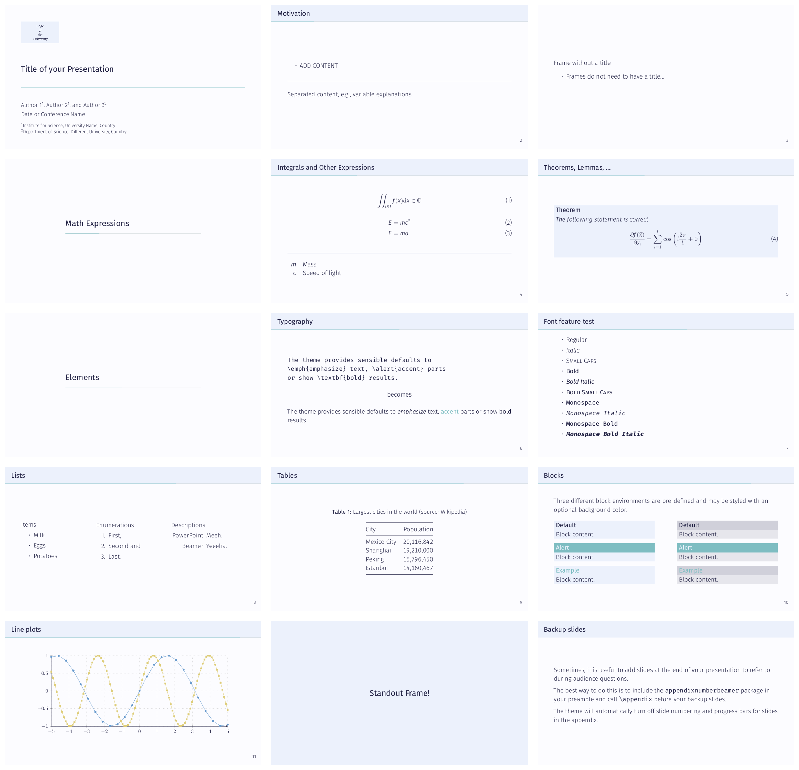

This repository is a fork of Karl-Ludwig Besser's [Metropolis-based beamer
template](https://github.com/klb2/beamer-presentation-template). Unfortunately, 
the [metropolis theme](https://github.com/matze/mtheme) is no longer maintained 
and several issues emerged throughout the years (even to the extend that beamer
itself had to implement several patches to stop the theme from breaking). The 
[moloch theme](https://github.com/jolars/moloch), a fork of metropolis, aims to 
fix most of these problems, while also simplifying the code. As I hope that this theme
be more robust and more frequently maintained, I transferred Karl's template
to the moloch theme, trying to make as little changes as possible.

# Clean and Simple Beamer Presentation Template

This repository provides a clean and simple template for presentations made
with the LaTeX [beamer package](https://ctan.org/pkg/beamer).
The design is based on the [moloch theme](https://github.com/jolars/moloch),
a fork of the [metropolis theme](https://github.com/matze/mtheme).

It is highlighted by many guides on good slide design that slides should
contain no clutter and as few objects as possible.
Jean-luc Doumont says the following about slide templates in his talk about
[Creating effective slides](https://youtu.be/meBXuTIPJQk?t=2200):
> A template is a way to specify where the content should come and how the
> content should look once it comes there.  
> As long as you don't have content, there should be nothing.


# Installation
## On GitHub
Click on ["Use this template"](https://github.com/new?template_name=beamer-presentation-template&template_owner=klb2).

## Local Installation
Simply copy all of the `*.tex` files into a new folder.
Alternatively, you can use the
[`mkbeamerprsentation.sh`](mkbeamerprsentation.sh) script to automatically do
this for you.
The following command will create a new directory `name-of-the-paper-directory`
with the template and initialize a new Git repository.

```bash
bash mkbeamerprsentation.sh name-of-the-paper-directory
```

The file `presentation.tex` is the main file that needs to be compiled. It is
recommended to use `lualatex`, if you want to use the Fira fonts. These were
the default in the metropolis theme, however, the moloch theme disabled these font
settings, to be independent of the compiler. This template replicates the metropolis
fonts as follows:
```latex
\usepackage{fontspec}

\setsansfont[
  ItalicFont={Fira Sans Light Italic},
  BoldFont={Fira Sans},
  BoldItalicFont={Fira Sans Italic}
]{Fira Sans Light}
\setmonofont[BoldFont={Fira Mono Medium}]{Fira Mono}

\AtBeginEnvironment{tabular}{%
  \addfontfeature{Numbers={Monospaced}}
}
```

## Requirements
Make sure that you have a LaTeX installation on your computer, which includes
the [moloch theme](https://ctan.org/pkg/moloch). It should
be included in every popular LaTeX distribution like TeX live or MiKTeX.

If you want to use the [Fira fonts](https://github.com/mozilla/Fira), you need
to install them on your machine first.


# Usage
The file `presentation.tex` is the main file that needs to be compiled. It is
recommended to use `lualatex`, if you want to use the Fira fonts that are the
default fonts in the metropolis theme.


# Customization
## Colors
The template allows an easy customization of the colors and styles according to
your needs.
In particular, you only need to edit the color definitions in the
[`setup-colors.tex`](setup-colors.tex) file.

There are four colors in this theme which you can adjust to your needs:
```latex
\definecolor{accent}{HTML}{7EBDC2} % accent color
\definecolor{bgcolor}{HTML}{FCFCFF} % background color
\definecolor{bgcolorAlt}{HTML}{ECF1FC} % alternative/second background color
\definecolor{fgcolor}{HTML}{222244} % foreground/text color
```

`accent`
: Accent color that is used for the progress bar and `\alert{text}`.

`bgcolor`
: Main background color that is used as the background color of the slides.

`bgcolorAlt`
: Second/alternative background color that is used as the background color of
the slide titles and as the background color for boxes.

`fgcolor`
: Foreground color that is used as the text color.

## Logo
If you want to show the logo of your institution/university on the title page,
you simple need to adjust the `\titlegraphic` command like
```latex
\titlegraphic{\includegraphics[height=.17\textheight]{logo.png}}
```
where `logo.png` refers to the image file of the logo.

# Example
The following image shows the provided example slides with an example color
scheme.


